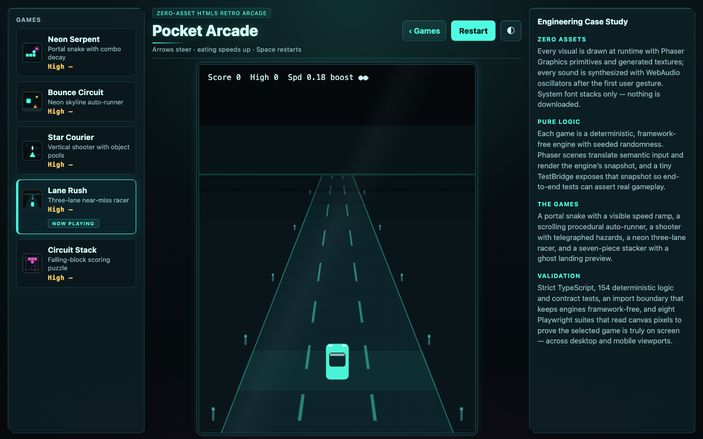
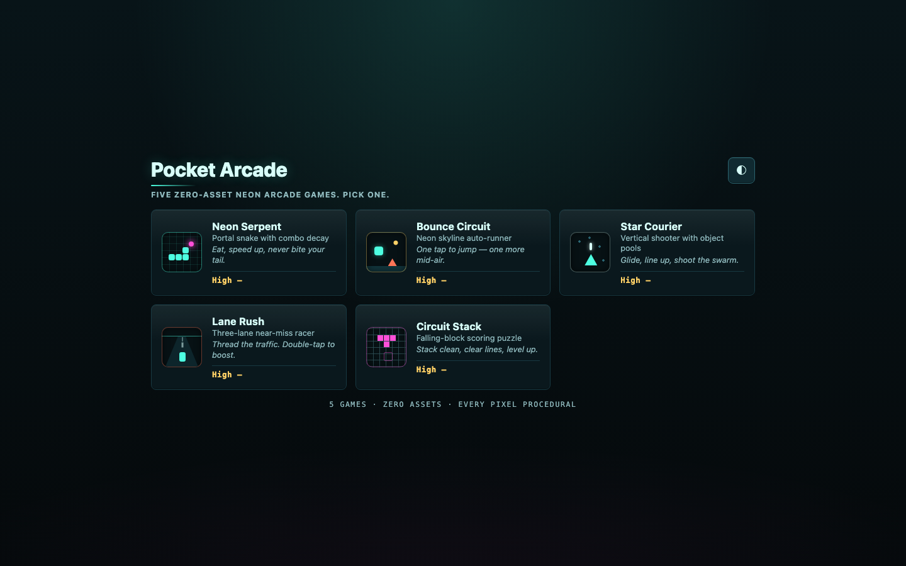
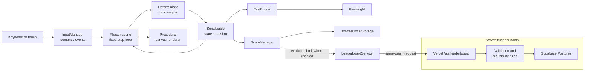

# Pocket Arcade

**Five original arcade games in one responsive browser app. Every visual is drawn in code, and every sound is synthesized at runtime.**

Pocket Arcade is a playable portfolio project for exploring testable canvas-game architecture. Framework-independent TypeScript engines own the rules, Phaser scenes render their snapshots, and browser tests inspect the canvas to verify what players actually see.

[Play Pocket Arcade](https://arcade-game-five.vercel.app/) · [Browse the source](https://github.com/harshvardhan579/arcade-game)



## What makes Pocket Arcade different

The project uses constraints that make each game reproducible and independently testable:

- **Separated game truth and rendering**: each `*Logic.ts` engine stays free of Phaser, browser APIs, storage, and runtime entropy. A custom import-boundary check enforces this rule
- **Deterministic runs**: seeded randomness and a fixed-step loop let tests replay exact game states while normal play receives a fresh seed for every run
- **Runtime-generated presentation**: Phaser graphics primitives create the visuals, Web Audio creates the sound effects, and system fonts provide the typography. The app downloads no image, audio, sprite, or font assets
- **Tests at the visible boundary**: Vitest covers pure rules and state contracts. Playwright covers gameplay, persistence, responsive layouts, accessibility behaviors, and canvas pixels
- **Optional full-stack path**: a flag-gated leaderboard adds server-side validation and Supabase persistence without adding network requests to the default local experience

## Play five distinct games

Choose a game from the home screen, play with a keyboard or touch controls, and restart with a newly generated run seed. Local high scores persist in the browser. Deployments can also enable explicit global-score submission after a run.



| Game               | Genre                | Core mechanics                                                                                |
| ------------------ | -------------------- | --------------------------------------------------------------------------------------------- |
| **Neon Serpent**   | Grid snake           | Portal wrapping, combo decay, seeded obstacles, and an increasing step rate                   |
| **Bounce Circuit** | Auto-runner          | Seeded terrain chunks, coyote time, jump buffering, double jump, and collectible orbs         |
| **Star Courier**   | Vertical shooter     | Column-based movement, pooled entities, telegraphed debris, and escalating waves              |
| **Lane Rush**      | Three-lane racer     | Pseudo-3D depth, near-miss scoring, speed progression, and a double-tap boost                 |
| **Circuit Stack**  | Falling-block puzzle | Seven-piece bag randomization, wall kicks, ghost preview, line clears, and increasing gravity |

## Run it locally

The base arcade needs no account, database, or environment variables.

### Prerequisites

- Node.js 22 or newer
- npm

### Start the app

```bash
git clone https://github.com/harshvardhan579/arcade-game.git
cd arcade-game
npm ci
npm run dev
```

Open [http://127.0.0.1:5173](http://127.0.0.1:5173), choose a game, and use the displayed keyboard controls. The Vite development server binds to the loopback interface, so it is not exposed to the local network by default.

You can also open a game directly:

```text
http://127.0.0.1:5173/?game=lane-rush
```

Stop the server with `Ctrl+C`. To reset local scores, the saved player name, and the theme preference, clear site data for `127.0.0.1:5173` in the browser.

## Architecture

Game rules remain portable because browser and Phaser concerns stay at the edges.



### Runtime decisions

- **Pure logic engines**: scenes translate semantic input, step the engine, and render its returned state. Logic modules do not import Phaser or reach into the Document Object Model (DOM)
- **Enforced boundaries**: `scripts/import-boundary.mjs` scans logic and test files for restricted dependencies. ESLint separately limits where Phaser can be imported
- **Fixed-step simulation**: `BaseGameScene` uses an accumulator, keeping rule updates independent from render-frame timing
- **Seed ownership at the scene edge**: live runs mix clock and counter values into fresh seeds. Unit and browser tests can inject fixed seeds for repeatable outcomes
- **Inspectable state without framework leakage**: `window.__ARCADE__` exposes detached, JSON-serializable snapshots to browser tests, not Phaser objects
- **Shared browser services**: one input manager normalizes keyboard and virtual controls. One lazily unlocked Web Audio context synthesizes cues. Safe storage wrappers preserve play when `localStorage` is unavailable

## Repository map

The main directories follow the runtime boundaries:

```text
src/
├── core/                  # Input, audio, seeds, storage, scores, and test bridge
├── games/<game>/          # Pure logic, Phaser scene, and colocated unit tests
├── leaderboard/           # Shared validation, plausibility rules, and server core
├── ui/                    # Responsive DOM shell and optional leaderboard panel
└── main.ts                # Game registry, Phaser setup, and scene switching
api/leaderboard.ts         # Vercel function adapter
scripts/import-boundary.mjs
tests/                     # Playwright browser suites
```

## Testing and quality gates

The default validation sequence type-checks both application and API code, builds the client, runs unit tests, checks formatting and architecture boundaries, then runs the browser suite.

Install Playwright's Chromium build once before the full check:

```bash
npx playwright install chromium
npm run validate
```

Use narrower commands while developing:

| Command                                                          | Checks                                                                       |
| ---------------------------------------------------------------- | ---------------------------------------------------------------------------- |
| `npm run build`                                                  | Strict TypeScript for `src/` and `api/`, followed by a Vite production build |
| `npm run test`                                                   | Vitest unit and contract tests                                               |
| `npm run lint`                                                   | ESLint, the custom import boundary, and Prettier                             |
| `npm run test:e2e`                                               | Playwright on desktop Chromium and an emulated Pixel 5 viewport              |
| `npx vitest run src/games/neon-serpent/NeonSerpentLogic.test.ts` | One game's logic suite                                                       |

The browser suites test more than DOM state. The scene-switching regression counts game-specific pixel colors on the canvas, which catches a running scene rendered over the selected scene. Leaderboard browser tests mock `/api` routes, so they validate the client contract without contacting Supabase.

## Optional leaderboard and trust model

The base arcade is local-first. The global leaderboard is disabled unless the client build sets `VITE_LEADERBOARD_ENABLED=1`.

When enabled, the browser sends same-origin requests to `api/leaderboard.ts`. Only that serverless function reads the Supabase service-role key. The API validates the request origin, content type, body size, game identifier, player name, score shape, tick count, run seed, and a game-specific plausibility bound before calling the database function. Submitter Internet Protocol (IP) addresses are salted and hashed before transport to the database layer.

Server-only configuration:

| Variable                    | Purpose                                         |
| --------------------------- | ----------------------------------------------- |
| `SUPABASE_URL`              | Supabase project endpoint                       |
| `SUPABASE_SERVICE_ROLE_KEY` | Privileged database credential                  |
| `LEADERBOARD_IP_SALT`       | Salt used before hashing a submitter IP address |

Client build configuration:

| Variable                     | Purpose                                             |
| ---------------------------- | --------------------------------------------------- |
| `VITE_LEADERBOARD_ENABLED=1` | Includes and enables the leaderboard user interface |

Keep the three server variables out of `VITE_` names because Vite exposes prefixed values to browser code. `.env*` and `.vercel` are ignored by Git.

This boundary reduces accidental credential exposure; it is not an anti-cheat system. The leaderboard has no accounts or score ownership. Plausible, correctly shaped submissions cannot be proven to come from an unmodified client. Rate limiting is delegated to the database function.

The repository does not include Supabase migrations or a standalone deployment recipe. You can run the arcade locally from a fresh clone, but reproducing the leaderboard requires an externally provisioned schema and stored procedure.

## Responsive and accessible interaction

The shell has separate desktop, mobile portrait, and phone-landscape compositions. Desktop uses a game selector, canvas stage, and case-study panel. Mobile uses a game picker and split touch controls without requiring page scroll during play.

The interface includes keyboard navigation, visible focus states, labeled controls, touch targets with a 44 px minimum, persisted dark and light themes, safe-area insets, and reduced decorative motion when `prefers-reduced-motion` is active. Automated browser coverage uses Chromium at a desktop viewport and an emulated Pixel 5 viewport; other engines and devices are not part of the current suite.

## Tech stack

Versions come from the pinned direct dependencies in `package.json` and `package-lock.json`.

| Layer            | Technology                             | Purpose                                                               |
| ---------------- | -------------------------------------- | --------------------------------------------------------------------- |
| Game runtime     | Phaser `3.90.0`                        | Canvas scenes, graphics primitives, text, camera effects, and scaling |
| Application      | TypeScript `6.0.3`                     | Strictly typed game, UI, and server code                              |
| Build            | Vite `8.1.3`                           | Local development and production bundles                              |
| Unit tests       | Vitest `4.1.9`                         | Deterministic rules and state contracts                               |
| Browser tests    | Playwright `1.61.1`                    | Gameplay, persistence, responsive layout, and rendered-canvas checks  |
| Quality          | ESLint `10.6.0` and Prettier `3.9.4`   | Static analysis and formatting                                        |
| Optional backend | Vercel Functions and Supabase Postgres | Leaderboard API and persistence                                       |

The production build separates Phaser into its own vendor chunk. This keeps application changes out of the larger framework chunk, but Phaser remains the dominant initial download.

## Deployment

The hosted demo serves the Vite build from Vercel and attaches the optional serverless endpoint under `/api/leaderboard`. A static deployment only needs:

```bash
npm ci
npm run build
```

Publish the generated `dist/` directory on a static host. Deep links use query parameters such as `?game=lane-rush`, so they do not require rewrite rules.

## Current limitations

Pocket Arcade is a portfolio project rather than a released game platform. Its current boundaries are explicit:

- Each game is an endless single-player score run with no save-state or pause persistence
- Browser data is best-effort local storage and disappears when site data is cleared
- The optional leaderboard depends on externally managed Vercel and Supabase resources
- Leaderboard submissions use plausibility checks, not accounts or tamper-proof attestation
- Browser automation currently targets Chromium only
- The repository has no continuous integration workflow, release tags, contributor guide, security policy, or checked-in database migrations
- No license file is present, so reuse permissions have not been specified

## Project status

The repository is a working, deployed portfolio project at version `0.1.0`. The core arcade runs without external services. The leaderboard remains optional and operationally dependent on deployment configuration.
